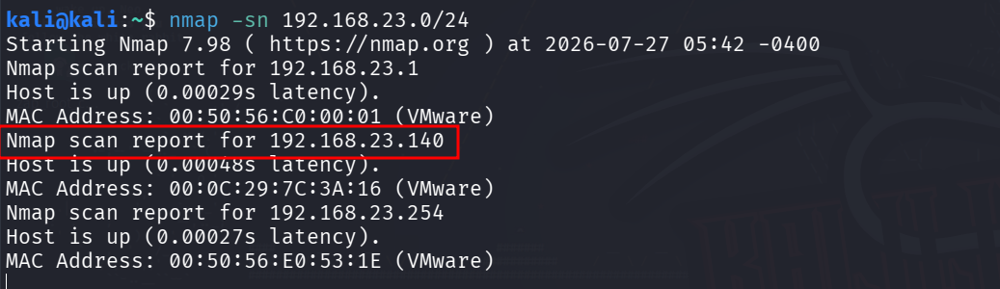
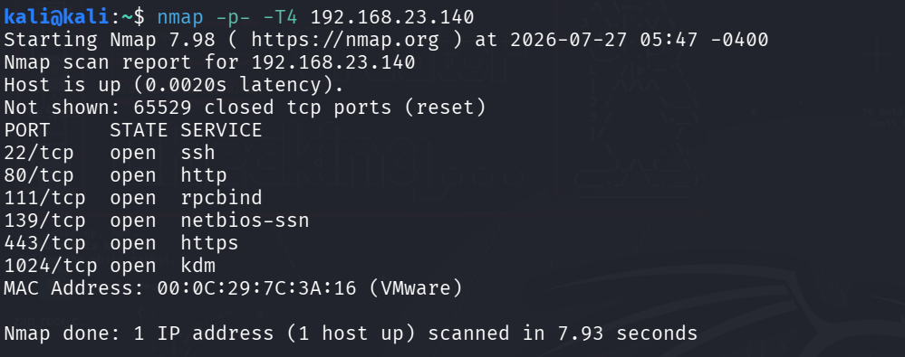
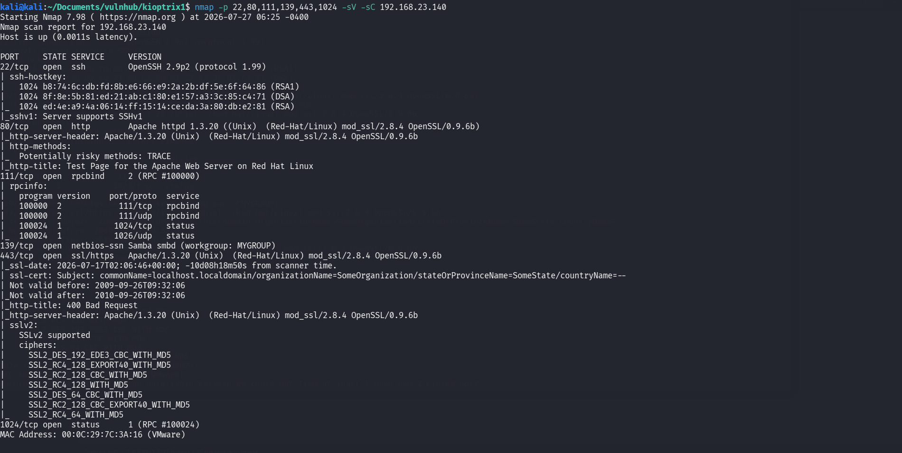
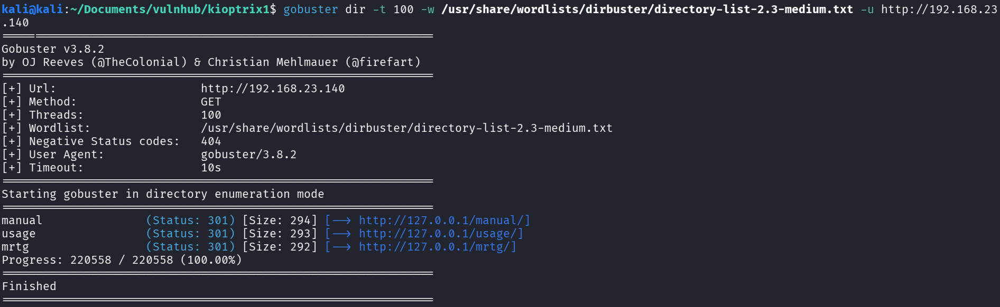
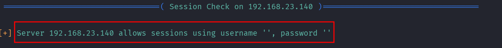
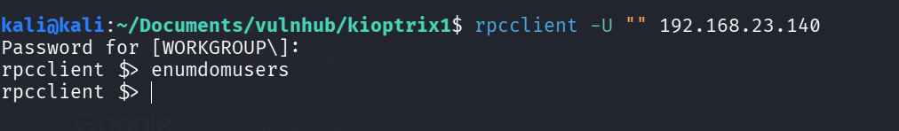
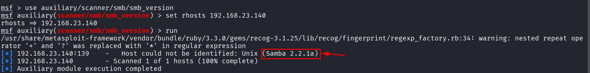
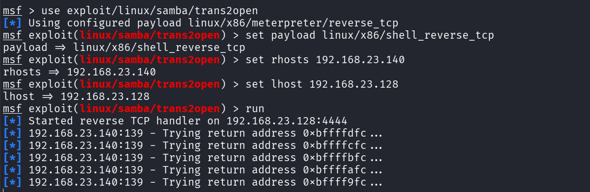
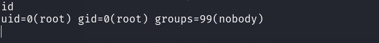

## Vulnhub — Kioptrix1 Walkthrough


## Summary

Kioptrix Level 1 is a beginner-friendly boot-to-root virtual machine designed to teach the fundamentals of penetration testing. The objective is to obtain root access by identifying and exploiting intentionally vulnerable services running on the target system. The lab emphasizes methodology over simply running exploits


## Enumeration


First Let's discover our target machine on our network using nmap


``` nmap -sn 192.168.23.0/24 ```





<br><br><br>


We can now see that our target machine is in ip 192.168.23.140 and let's start the port scan


``` nmap -p- -T4 192.168.23.140 ```





<br><br><br>


We can see that there are 6 ports were open, so let's run the service discovery


``` nmap -p 22,80,111,139,443,1024 -sV -sC 192.168.23.140 ```





<br><br><br>


We got the service information and samba smb and mod\_ssl were really interesting findings and we also got port 80 \& 443 open, so let's run a directory brute forcing using gobuster


``` gobuster dir -t 100 -w /usr/share/wordlists/dirbuster/directory-list-2.3-medium.txt -u http://192.168.23.140```





<br><br><br>


So we got nothing interesting from the directory brute forcing. I ran enum4linux and I found out NULL sessions were allowed in the rpc 


``` enum4linux 192.168.23.140 ```





<br><br><br>


Let's try to connect to the target machine with rpcclient


``` rpcclient -U "" 192.168.23.140 ```





<br><br><br>


We got no information from the rpcclient. Let's try to enumerate the samba smb version using msfconsole search functionality named


``` auxiliary/scanner/smb/smb\_version ```





<br><br><br>


Now we know that the version of samba was 2.2.1a which is vulnerable for trans2open


## Exploit


trans2open:


The function copies user-supplied path data into a fixed 1024-byte static memory buffer without properly verifying input lengths,  Sending data larger than 1024 bytes overwrites adjacent stack variables, including saved function return addresses, letting attackers redirect code execution flow


There is an built-in msf exploit for this vulnerability


``` exploit/linux/samba/trans2open ```





<br><br><br>


Now after running the exploit we got a root shell back from msf.





<br><br><br>


## The Reason why I choose trans2open over mod_ssl


The Samba trans2open exploit was chosen over the mod_ssl exploit because the mod\_ssl exploit provides a shell with apache user privileges, requiring an additional local privilege escalation step to obtain root access. In contrast, the Samba trans2open vulnerability directly grants a root shell upon successful exploitation, making it a more efficient attack path.


## Remediation:


* Upgrade Samba to a patched version that is not vulnerable to CVE-2003-0201.
* Regularly apply security updates to the operating system and all network services.
* Restrict SMB access using firewall rules and allow connections only from trusted hosts.
* Disable or remove unnecessary services to reduce the attack surface.
* Perform periodic vulnerability assessments and penetration tests to identify outdated software.


## Lessons Learned

* Thorough enumeration is essential for identifying vulnerable services.
* Running outdated software significantly increases the risk of system compromise.
* Services running with elevated privileges can lead to immediate root access if exploited.
* Timely patch management is critical to prevent exploitation of known vulnerabilities.


## Conclusion

The assessment successfully demonstrated that the target system was vulnerable to the Samba trans2open Stack Buffer Overflow (CVE-2003-0201). Exploiting this vulnerability resulted in direct root-level access, highlighting the critical impact of unpatched services. Implementing regular updates, restricting service exposure, and following security best practices will significantly reduce the risk of similar attacks in production environments.

