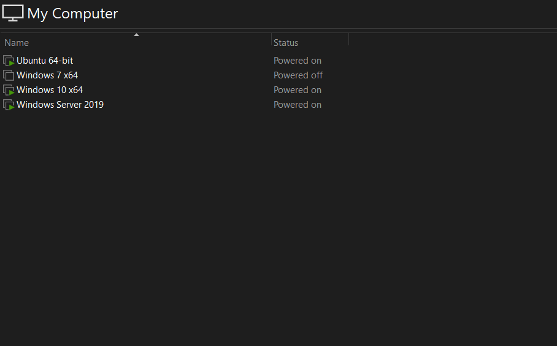
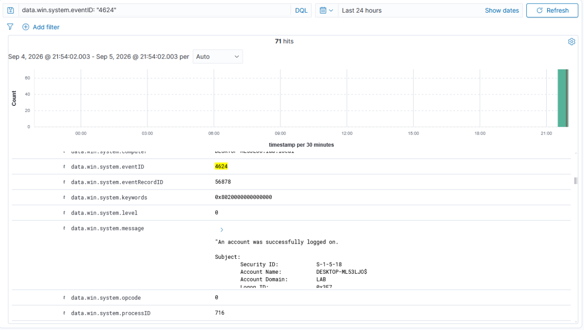
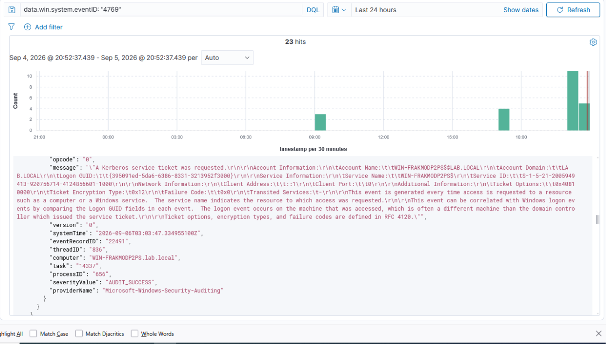
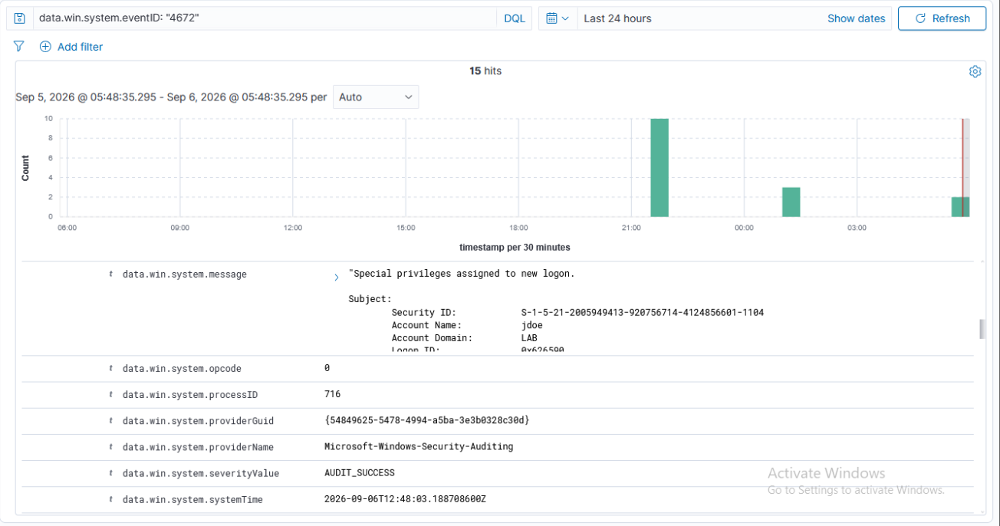

# Building a Home SOC: Monitoring Active Directory Authentication with Wazuh

## Why I Built This

My background so far has been mostly offensive — Active Directory attack paths, Kerberoasting, AD CS abuse. As I've moved toward Security Engineering, I wanted hands-on experience on the other side: standing up a SIEM, connecting real endpoints to it, and understanding exactly what a defender sees when the attacks I already know how to run actually happen.

This write-up covers the lab I built: a Wazuh SIEM ingesting Windows Security Event Log data from a domain controller and a workstation, focused on four event IDs that matter most for AD authentication monitoring.

## Lab Architecture

- **Wazuh manager, indexer, and dashboard** — Ubuntu Server 24.04 LTS VM
- **Windows Server 2019** (domain controller) — Wazuh agent installed, forwarding Security Event Log data
- **Windows 10** (domain-joined workstation) — Wazuh agent installed
- All running in a VMware-based home lab

## What I'm Monitoring

I focused on four event IDs first, since together they cover the core of AD authentication activity:

| Event ID | What it means | Why it matters |
|---|---|---|
| **4624** | Successful logon | Baseline for normal activity; Logon Type field tells you *how* (interactive, network, RDP, etc.) |
| **4625** | Failed logon | Brute-force and password-spray detection; the Sub Status code says *why* it failed |
| **4769** | Kerberos service ticket requested | Fires on the DC for every service access — also the event that surfaces Kerberoasting activity |
| **4672** | Special privileges assigned to new logon | Fires alongside 4624 when the session gets admin-equivalent rights — tells you where privileged accounts are actually logging on |

## Verifying It Works

To confirm the pipeline was actually working end to end, I generated each event type deliberately and watched it land in the Wazuh dashboard:

- **Successful logon** — logged on as a domain user → 4624 appeared within seconds.
 
  
- **Kerberos ticket request** — accessed a file share on the DC from the Windows 10 client → 4769 appeared, logged on the domain controller.
 
  
- **Privileged logon** — logged on as a Domain Admin account → 4624 and 4672 both appeared with the same Logon ID, confirming they were the same session.
 
  

## Challenges

The Wazuh manager went through three different builds before landing on something stable.

I originally deployed it on Ubuntu Server 22.04 LTS, but ran into a persistent `wazuh-indexer` service error. After about two hours of troubleshooting without success, I switched to Ubuntu Desktop 24.04 LTS, which worked — but introduced a hardware problem instead. With only 16GB of DDR4 RAM, running Ubuntu Desktop's GUI alongside Windows 10 and Windows Server 2019 simultaneously pushed the laptop past its limit and caused crashes. I then moved to Ubuntu Server 24.04 LTS, which — unlike the original v22.04 install — has worked reliably, and is what the lab runs on now.

## What's Next

This lab currently relies on Wazuh's built-in detection for these event types. The next phase:

- Writing a custom detection rule for Kerberoasting activity — specifically, a burst of 4769 events requesting RC4 encryption (type `0x17`) instead of AES, which is the classic sign of a roasting tool downgrading the ticket
- Tuning thresholds so the rule doesn't fire on normal RC4 traffic, since 4769 is high-volume in any live domain
- Extending monitoring toward the cloud side — Entra ID sign-in logs, Conditional Access evaluations, and PIM activation events — as I move further into the Azure/Entra track
