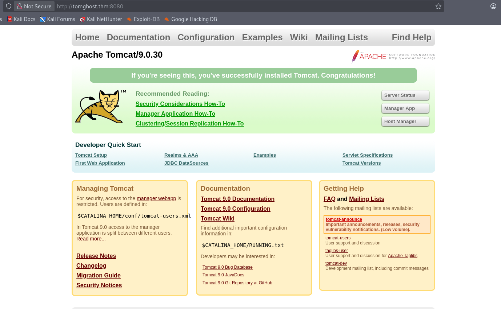
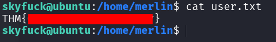
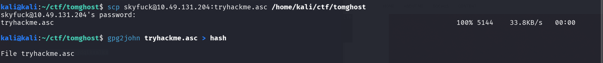
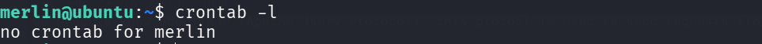
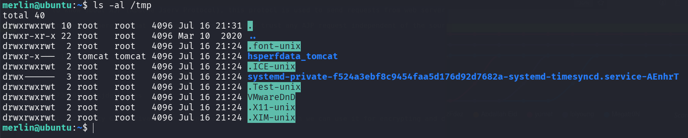
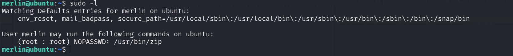
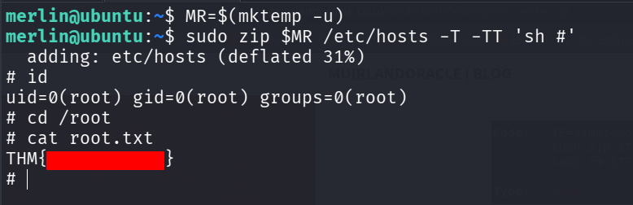

## TryHackMe — Tomghost


Room: Tomghost · Difficulty: Easy · Category: Linux / Apache Tomcat


## Summary

Tomghost is a beginner-friendly Linux machine that focuses on Apache Tomcat exploitation, PGP key passphrase cracking, and privilege escalation through misconfigured binaries. The room reinforces practical skills in enumeration, credential recovery, lateral movement, and local privilege escalation.


## Enumeration

So now our target IP is 10.10.175.138 and the nmap scan returns four open ports 


```nmap -Pn -n -T4 10.10.175.138```


<br><br><br>

Let's see the services of these specific ports


```nmap -p 22,53,8009,8080 -sC -sV 10.10.175.138```


<br><br><br>

We can see that there is an Apache Tomcat 9.0.30 running a http service via port 8080


And also we can see that Apache Jserv Protocol running at port 8009 which is a really good finding


We can see that this is the Tomcat home page in the port 8080




<br><br><br>

I know that there is an exploit in Metasploit for this particular version of tomcat and also there are many exploits out there to use, But before that we need to know what exactly is AJP


## AJP


AJP (Apache Jserv Protocol), this protocl is used to send requests from web server to backend application server like tomcat and usually runs at port 8009. But the problem in here is that this tomcat version highly trust any AJP request independent of the source, so a attacker can read the sensitive files and also can include payloads by crafting a AJP request. so that's the reason why this service port should be inaccessible for unknown users.


## Exploit


We're using this particular exploit named ghostcat as now on msfconsole


```Exploit: auxiliary/admin/http/tomcat\_ghostcat```


<br><br><br>

After setting up RHOSTS and ran toward our target we got a user's credential named "skyfuck"


<br><br><br>

Now we can login as the user skyfuck via ssh and we can see that there are two files named credentials.pgp and tryhackme.asc in the home directory


<br><br><br>

There is another user named merlin and we can able to read the files of merlin's home directory due to weak permissions. we got our flag




<br><br><br>

OK now let's take a look at those two files we saw before and before that we need to know about PGP


## PGP

pgp stands for Pretty Good Privacy and is an encryption program which we can use it for encrypting and decrypting files via credentials or public keys.


When we try to decrypt it with GPG tool it asks for passphrase which is really good for them but not for us.


<br><br><br>

So now we need to transfer this tryhackme.asc file to our local machine and try to crack the hashes using gpg2john.




<br><br><br>

Now we got the hashes and got the passphrase when we cracked it using john


<br><br><br>

Now we can use this obtained passphrase to decrypt the credentials.pgp file.

After Decrypting we got a user credential named merlin which we already know that this user is exist on the machine


<br><br><br>


## Post Exploitation


<br><br><br>

Before proceeding to automated tools like LinPeas we can do some manual search for any privilege escalation vector. we don't have any cronjobs for merlin




<br><br><br>

And also there isn't anything good in the /tmp folder 




<br><br><br>

While Running sudo -l we can see that we can run /usr/bin/zip as sudo without Password, So now this is our privilege escalation vector.




<br><br><br>

## Privilege Escalation 

We got our payload ready and can use it, zip's -T/-TT test-after-archiving flag lets you run arbitrary commands as the sudo-permitted user and we're abusing it here. After using the payload we got root access and can able to read the root.txt file for flag.




<br><br><br>

## Root Cause \& Remediation


Root cause:

The server was running a vulnerable version of Apache Tomcat (Ghostcat - AJP), allowing unauthorized file disclosure and credential exposure.

Weak credential management and an easily crackable PGP key passphrase enabled attackers to recover valid user credentials and gain unauthorized access. Additionally, a misconfigured SUID binary allowed privilege escalation to the root user.


Remediation:

Update Apache Tomcat to a patched version, disable or restrict the AJP connector if not required, and regularly apply security updates.

Enforce strong passphrases for cryptographic keys, store sensitive credentials securely, remove unnecessary SUID permissions, and conduct periodic security audits to identify and remediate privilege escalation paths


## Lessons Learned / Conclusion


This room demonstrated the importance of thorough enumeration, as identifying the vulnerable Apache Tomcat AJP service was the key to obtaining initial access. It also reinforced practical skills in handling PGP-encrypted files, cracking weak passphrases, credential reuse, and exploiting misconfigured SUID binaries for privilege escalation. Overall, the room highlights how multiple seemingly minor weaknesses can be chained together to achieve full system compromise and emphasizes the importance of secure configuration, strong credential management, and timely patching.

