## TryHackMe — Valley

Room: Valley · Difficulty: Easy · Category: Linux / Web Recon


## Executive Summary


Valley is a beginner-friendly Linux machine that focuses on web enumeration, source code analysis, credential discovery, and privilege escalation through misconfigured binaries. The room strengthens practical skills in reconnaissance, exploiting exposed information, and chaining multiple weaknesses to achieve full system compromise.


## Enumeration


Our target machine is in IP 10.48.177.79, Note that this IP may change in later processes if it take more time than tryhackme machine expiry time!

Used nmap and we can see there is only three port 22, 80 and 37370 are open


``` nmap -Pn -n -T4 -p- 10.48.177.79 ```


After this we ran nmap service detection scan on the target specific ports and got the service's information and also there is FTP service running on port 37370 which is quite intresting


``` nmap -sC -sV -p 22,80,37370 10.48.177.79 ```


On visiting the webpage at port 80 can see that it's a photography based website


After spending 20 minutes of inspecting this website I found nothing useful, then i ran fuzzing on the subdirectory of the webpage and found a interesting subdirectory named "00"


On visiting the found subdir we got an interesting subdirectory named "/dev1243224123123"


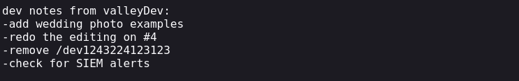


There is an login page in the found dir


I tried to brute force the login with hydra but got nearly 200+ false positive. then after carefully inspecting the sight I found a JS file named "dev.js"


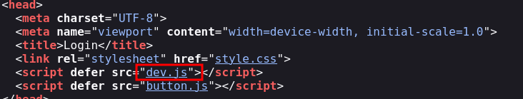


On the dev.js file we can found the a user name and password


We can able to login to the webpage using this credential and we got an information mentioning 

"Stop reusing Credentials"

We know that there is an ftp service running in the port 37370 so let's try to login in with the credentials we got and yes we are in!


We can see that there are three pcapng files in there. so let's try to download and inspect it with the help of wireshark


On the particular file named "siemHTTP2.pcapng" we can see a user credential named "valleyDev" on the http packet


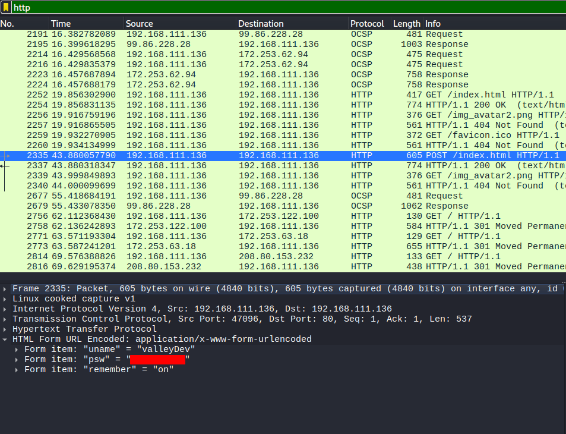


So now let's try to login to the user valleyDev using SSH


We got the user flag in the user.txt at home directory


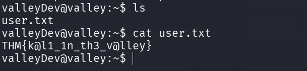


After searching few minutes I found an executable file in the "/home" directory named

"valleyAuthenticator" and when I ran that file it asks for username and password, i tried to enter the old credentials I got but it doesn't works


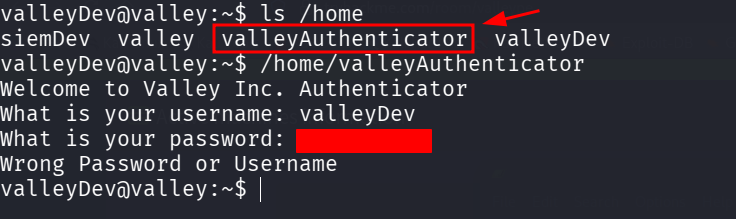


Let's transfer it to the local machine and try to convert the executable data using "Stings" tool


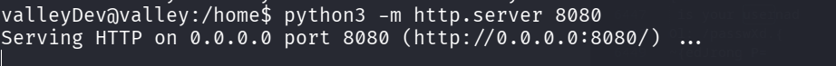


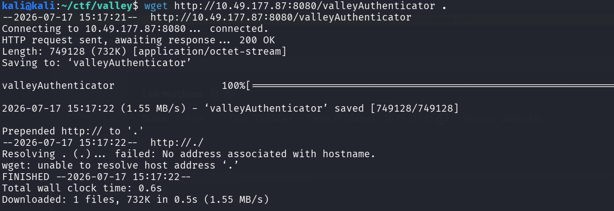


Now we can use Strings tool convert the data to readable format and store in "valley.txt"


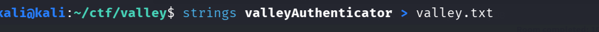


And we can able to find a encrypted md5 hash above the line "Welcome to valley Inc"


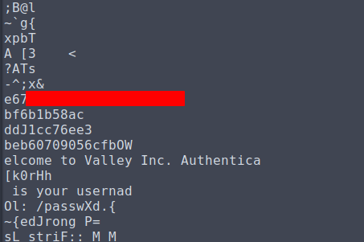


I tried to crack this md5 hash with an website called crackstation and we got an password, we can try this password for login to other users in the target machine, Guess what we successfully logged in as the user "valley" with the obtained password


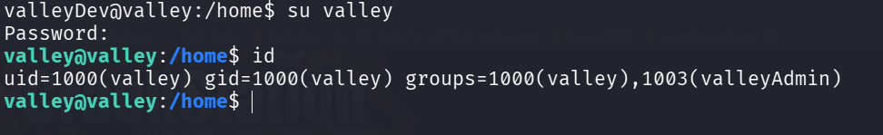


## Privilege Escalation


Now we need to escalate our privilege to root in order to read the root flag. 

I found that there is a cronjob that runs the file "photosEncrypt.py" as root on every one minute


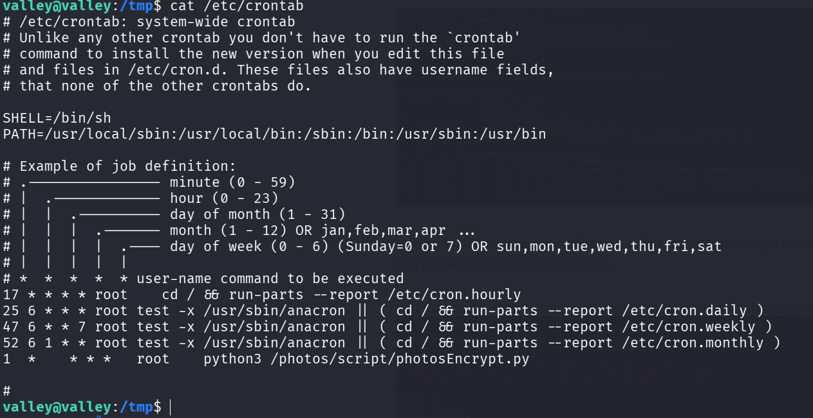


So let's inspect the file photosEncrypt.py. In there we can see it picks a image file from the directory and encrypt it with base64. 


So in here python uses the module base64.py and we can have access to write this module.the cron job's working directory puts your writable location ahead of the real module in search order, so lets add our payload to the base64.py file which gives us root shell when it gets executed by the cronjob.


``` import os

os.system("chmod u+s /bin/bash") ```


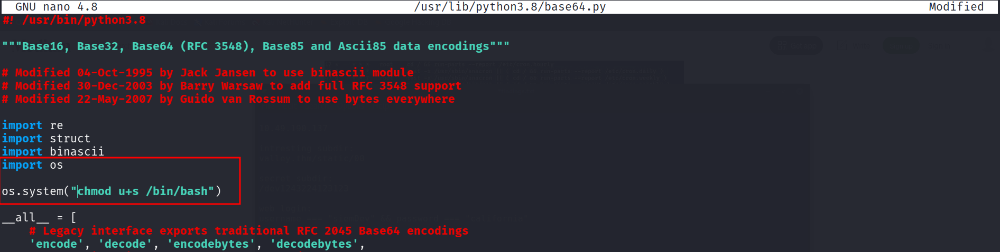


And after a minute we got our root shell by running the cmd ```/bin/bash -p``` and now we can able to read the root.txt file


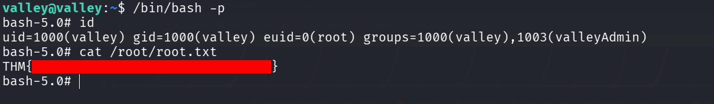


## Root Cause & Remediation


Root cause:


Sensitive information, including user credentials, was exposed through publicly accessible web resources, enabling unauthorized access to the target system.

Weak system hardening, insecure file permissions, and a misconfigured privileged binary allowed an authenticated user to escalate privileges and obtain root access.


Remediation:


Remove sensitive information from publicly accessible directories, enforce secure credential management practices, and regularly review web applications for information disclosure vulnerabilities.

Apply the principle of least privilege by restricting unnecessary file permissions and SUID binaries, keep software up to date, and perform periodic security audits to identify and remediate privilege escalation vectors.


## Lessons Learned / Conclusion


This room highlighted the importance of thorough web enumeration and analyzing exposed resources to uncover sensitive information leading to initial access. It also demonstrated how improper credential management and privilege misconfigurations can be chained together to compromise an entire system. Overall, the room reinforces the value of secure configuration, regular security assessments, and the principle of least privilege in defending Linux environments.

